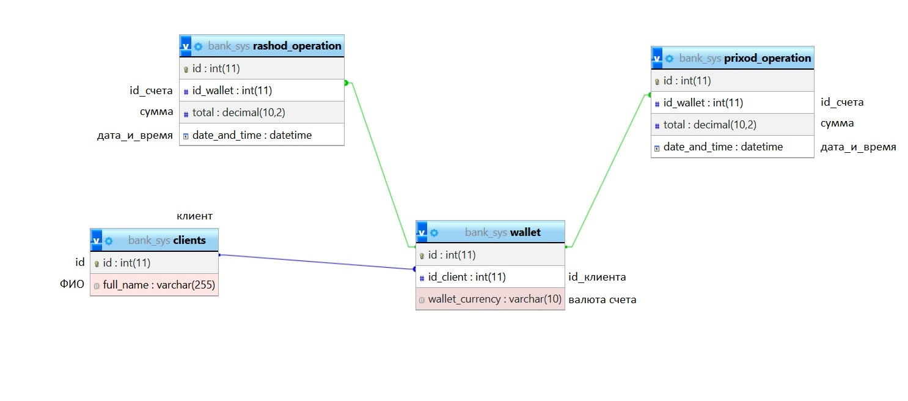
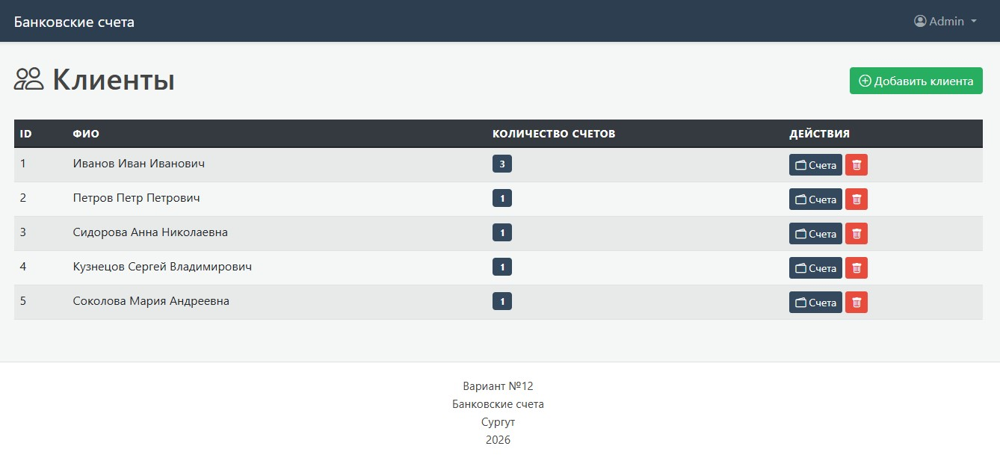

# Вариант №12
***
## Описание варианта
Банковские счета. Содержит сведения о счетах клиентов, приходных и расходных операциях. Сущности: клиент – id(PK), ФИО; счет – id(PK), id_клиента (FK), валюта счета; приходная_операция – id(PK), id_счета (FK), сумма, дата_и_время; расходная_операция – id(PK), id_счета (FK), сумма, дата_и_время;
***
## Функционал
- Авторизация пользователей
- Управление клиентами
- Управление счетами
- Управление приходными и расходными операциями
***
### 

***

***

***

***

### Выполнил
Хамидов А.А. Сургутский государственный университет, "Программная инженерия", 5 курс, 2026 г.
